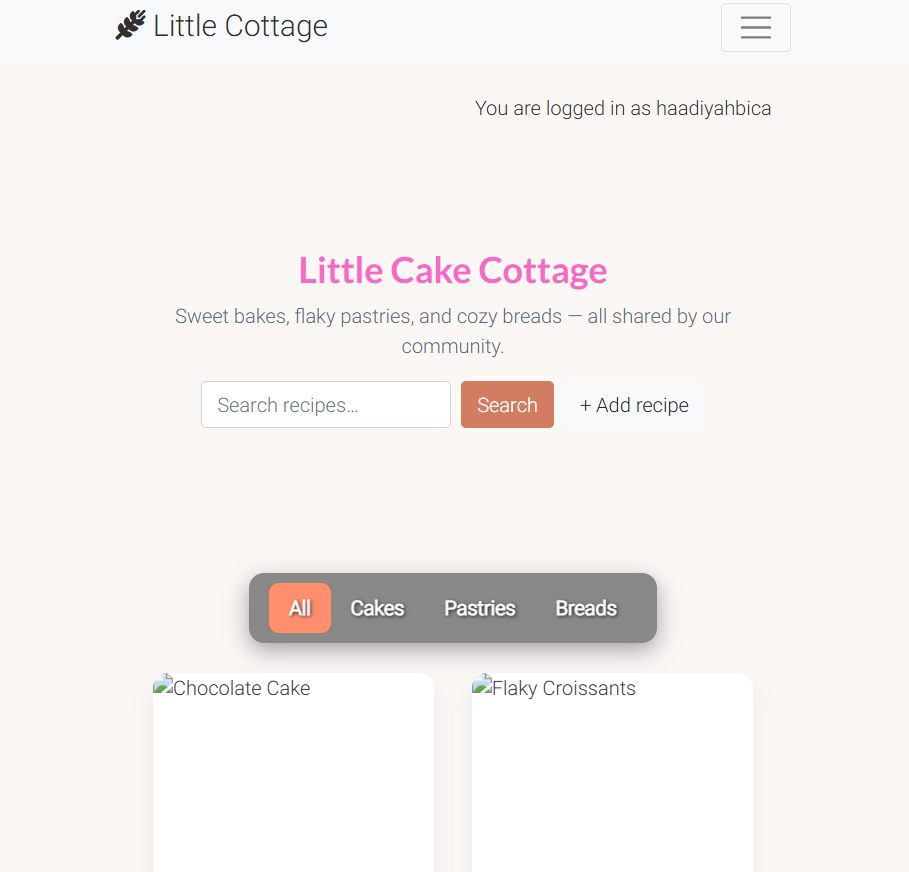

# 🍰 Cake Cottage
Welcome to Cake Cottage, a community-driven platform where baking enthusiasts can share their favorite recipes, interact with fellow bakers, and discover new delights! Whether you're a professional pastry chef or a home baker looking to experiment, our website provides a space to create, publish, and engage with mouth-watering baked goods.

At Cake Cottage, you can:

✔️ Post your own recipes and inspire others with your culinary creations.

✔️ Browse through a variety of delicious recipes from other users.

✔️ Like and comment on recipes to connect with fellow bakers.

✔️ Engage in discussions, ask questions, and share tips in the comment section.

✔️ Discover new flavors and experiment with creative baking ideas!

## 📌 Table of Contents

- [🍰 Cake Cottage](#-cake-cottage)
  - [📌 Table of Contents](#-table-of-contents)
    - [User Stories](#user-stories)
  - [🔠 Typography](#-typography)
  - [🔹 Existing Features](#-existing-features)
    - [👤 User Authentication \& Profile Management](#-user-authentication--profile-management)
    - [🎉 Community Engagement](#-community-engagement)
- [📖 About the Website](#-about-the-website)
  - [🚀 Features](#-features)
  - [🎨 Design Process](#-design-process)
  - [Features Left to Implement](#features-left-to-implement)
  - [🛠 Technologies Used](#-technologies-used)
    - [🖥️ Front-End Technologies](#️-front-end-technologies)
    - [🖥️ Back-End Technologies](#️-back-end-technologies)
- [Common Errors \& Solutions](#common-errors--solutions)
    - [🚀 Deployment](#-deployment)
  - [Conclusion](#conclusion)
  - [🔹 API Endpoints](#-api-endpoints)
    - [📌 Recipe Endpoints](#-recipe-endpoints)
    - [💬 Comment Endpoints](#-comment-endpoints)
    - [❤️ Like Endpoints](#️-like-endpoints)
  - [🔒 User Authentication](#-user-authentication)
  - [Testing](#testing)
    - [Lighthouse performance:](#lighthouse-performance)
  - [🌍 Deployment](#-deployment-1)
  - [✅ Feel Free to Explore!](#-feel-free-to-explore)
- [📌 Getting Started](#-getting-started)
  - [🏗️ Installation Guide](#️-installation-guide)
  - [🤝 Contributing](#-contributing)
  - [**Credits** 🎖️](#credits-️)
    - [**Mentor Guidance**](#mentor-guidance)
    - [**Authentication - Django Allauth**](#authentication---django-allauth)
    - [**Troubleshooting Support**](#troubleshooting-support)
    - [**Educational Resources - Code Institute**](#educational-resources---code-institute)
    - [Readme file](#readme-file)
        - [📌 Back to top](#-back-to-top)

### User Stories
"**_As a user, I would like to_** _____________________________"

:white_check_mark: *denotes items that have been successfully implemented*

- :white_check_mark: Register and log in so that I can create and manage my recipes.
- :white_check_mark: Create, update, and delete recipes so that I can share my creations.
- :white_check_mark: Comment on recipes to give feedback, ask questions, and engage with other users.
- :white_check_mark: Like recipes to show appreciation and keep track of my favorites.
- :white_check_mark: View a list of all available recipes and filter them based on categories.
- :white_check_mark: Save my favorite recipes to revisit later.
- :white_check_mark: Easily navigate through the website with an intuitive and responsive design.

"**_As an admin, I want to_"

- :white_check_mark: **Manage the entire database**, ensuring that all user-submitted content is appropriate.
- :white_check_mark: **Approve, edit, or delete recipes** to maintain high-quality content.
- :white_check_mark: **Manage user accounts** by editing user details, suspending accounts, or deleting users when necessary.
- :white_check_mark: **Monitor user interactions** such as comments and likes to maintain a positive and respectful community.
- :white_check_mark: **Optimize website performance** to ensure fast loading times and smooth user experience.
- :white_check_mark: **Fix and troubleshoot errors** in the system to provide a seamless experience for users.
- :white_check_mark: **Access an admin dashboard** with tools to track site activity, user engagement, and database status.
- :white_check_mark: **Receive notifications for reported content** to take immediate action against inappropriate recipes or comments.

## 🔠 Typography
We use [Google Fonts](https://fonts.google.com/) to create a warm and welcoming aesthetic.
    
## 🔹 Existing Features
### 👤 User Authentication & Profile Management
✔️ **Register Account** – Users can create an account with secure authentication.

✔️ **Log In** – Existing users can access their accounts securely.

✔️ **Change Password** – Users can update their passwords from their profile.

✔️ **Log Out** – A simple one-click logout button.

✔️ **Delete Account** – Users can remove their entire account along with their recipes.

### 🎉 Community Engagement

✔️ Like & Comment on Recipes – Users can interact with others by liking and commenting on recipes.

🛠️ Admin Features

✔️ Manage User Accounts – Admin can edit or delete users.

✔️ Approve & Moderate Recipes – Admin can manage submitted content.

✔️ Track Site Activity – Admin can view analytics on user interactions.

**Add a Recipe**
- [CRUD] Users can create or add a new recipe with a title, description, ingredients, steps, category, and optional image.
**View a Recipe**
- [C**R**UD] Users can read or view any recipe from the main page or by searching/filtering.
- Each recipe shows:

  - Title, category, author, and created date.

  - Ingredients & preparation steps.

  - Associated image (if uploaded).

- Recipes are displayed in card format with filtering (All, Cakes, Pastries, Breads).
**Update a Recipe**
- [CR**U**D] Logged-in users can edit their own recipes.
- They can update the name, description, ingredients, steps, category, and image

**Delete a Recipe**
- [CRU**D**] Logged-in users can delete their own recipes.
- Admins also have permission to delete any recipe that violates guidelines.

**Admin Superuser**
- My ***'Admin'*** profile has several extra features, which currently include:
    - Edit / Delete any recipe from the database.
    - Delete any registered user from the database.
    - Receive email for new recipes added or edited from database as backup in case database is lost.
   
# 📖 About the Website

Cake Cottage is more than just a bakery website—it's a community-driven recipe hub where users can:

🍰 Explore Our Menu – Browse through a collection of freshly baked goods, including cakes, pastries, and breads.

📜 View Recipes – Each product comes with a detailed recipe section to help you recreate your favorite treats at home.

💬 Leave Comments & Likes – Engage with other baking enthusiasts by sharing thoughts and feedback on recipes.

📩 Contact Us – Reach out for custom orders, inquiries, or just to say hello!

## 🚀 Features

✨ User Recipes – Create and share your own baking masterpieces.

📌 Interactive Menu – View our collection of baked goods with detailed descriptions.

👍 Recipe Comments & Likes – Engage with the baking community.

📱 Responsive Design – Accessible on all devices.

## 🎨 Design Process

The design of Cake Cottage followed a user-centered approach, ensuring the website is intuitive, visually appealing, and responsive.

🔹 Planning & Reasoning

The color scheme was chosen to give a warm, cozy, and bakery-inspired feel (soft browns, cream, and pink tones).

Typography was selected to combine readability with a friendly aesthetic using Google Fonts.

Layout was structured with clarity in mind, ensuring recipes are easy to find and interact with.

🔹 Wireframes

Wireframes were created during the planning phase to outline structure and navigation.

Home Page Wireframe: Showcases the hero banner, navigation bar, recipe filters, and featured recipes.

Recipe Detail Page Wireframe: Displays ingredients, steps, image placeholder, comments, and like button.

- Home (Desktop)

` Key elements

Navbar: logo, primary links, Products dropdown, auth links, search

Hero: site title, tagline, search, “+ Add recipe”

Category filters: All / Cakes / Pastries / Breads

Recipe cards grid (image, title, meta, excerpt, CTA)

Footer with copyright `

- Recipe Detail (Desktop)

`Key elements

Title area over hero (title, category, byline, like/edit/delete when permitted)

Two-column “glass card” content: Ingredients and Instructions

Comments list + add comment (auth required)

Footer`

- Add / Edit Recipe (Desktop)

` Form fields

Title

Category (select)

Image upload (optional)

Short description / excerpt

Ingredients (textarea)

Instructions (textarea)

Submit / Cancel `

- Home (Mobile)

` Notes

Compact header with hamburger menu

Condensed hero with search + add

Horizontal/scrollable category filters

Stacked recipe cards

Footer `

🔹 Mockups

High-fidelity mockups were created to finalize design decisions such as:

Placement of search bar & filters.

Recipe cards layout (image + title + description).

Mobile responsiveness with collapsible menus.

🔹 Database Schema Diagram

The project uses a relational database with the following models:

User – authentication, profile management.

Recipe – linked to User, includes ingredients, steps, image, and category.

Comment – linked to User & Recipe.

Like – linked to User & Recipe.

## Features Left to Implement

## 🛠 Technologies Used

- [VS Code](https://code.visualstudio.com/) - Used as my primary IDE for coding.
- [GitHub](https://github.com/) - Used as remote storage of my code online.

### 🖥️ Front-End Technologies

- [HTML](https://developer.mozilla.org/en-US/docs/Web/Guide/HTML/HTML5)  - Used as the base for markup text.
- [CSS](https://developer.mozilla.org/en-US/docs/Web/CSS/CSS3) - Used as the base for cascading styles.
- [JavaScript](https://developer.mozilla.org/en-US/docs/Web/JavaScript) – Enhancing interactivity.
- [Bootstrap](https://getbootstrap.com/) – Providing a responsive design.

### 🖥️ Back-End Technologies
  Cake Cottage website is powered by a robust backend built with Django and PostgreSQL, ensuring scalability, security, and ease of development.

Technologies Used
* [Django 5.1.6](https://www.djangoproject.com/): A high-level Python web framework that simplifies development with its powerful ORM, authentication system, and built-in admin panel.

* [PostgreSQL](https://www.postgresql.org/): A powerful, open-source relational database used to store user-generated recipes, comments, and likes.

* [Gunicorn 23.0.0](https://gunicorn.org/): A WSGI HTTP server for running Django applications in production, ensuring efficient request handling.

* [psycopg2](https://pypi.org/project/psycopg2/): A PostgreSQL adapter for Python that allows Django to interact with the database.

* [dj-database-url](https://pypi.org/project/dj-database-url/): Simplifies database configuration by parsing database URLs from environment variables.
    
* [Whitenoise 6.9.0](https://whitenoise.readthedocs.io/en/latest/): Serves static files efficiently, allowing the site to perform well on platforms like Heroku.

* [django-heroku 0.3.1](https://pypi.org/project/django-heroku/): Automatically configures Django settings for deployment on Heroku.

# Common Errors & Solutions
During the development of the Little Cake Cottage website, several challenges and errors arose. Below is a list of common issues encountered along with their solutions.

1. "urlpatterns is not defined" Error
   
Problem:
- While working on Django settings, an error stating `urlpatterns is not defined` appeared.

Solution: 
- Ensure that the urlpatterns list is correctly defined at the bottom of urls.py.
- Also, check for missing or incorrect imports in urls.py.

2. Static Files Not Loading
Problem:
- CSS and JavaScript files were not being applied properly, and the python manage.py collectstatic command showed warnings about missing static files.

Solution:
- Ensure the STATICFILES_DIRS path is correctly set in `settings.py`.
- Run the command `python manage.py collectstatic` again.

3. "Failed to load resource: the server responded with a status of 404 (Not Found)"
Problem:
- Some images were not displaying on the website, and the browser console showed 404 Not Found errors.

Solution:
- Verify that the images exist in the correct static or media directory.
- If using uploaded images, ensure MEDIA_URL and MEDIA_ROOT are correctly configured in `settings.py`.

Add these lines to urls.py to serve media files during development:

### 🚀 Deployment
- **Heroku**
    - [Heroku](https://www.heroku.com) - Hosting platform.

1. Duplicate Static Files Warning in collectstatic
Problem:
- When running python manage.py collectstatic, warnings appeared stating that some static files were ignored due to duplication.

Solution:
- Check if there are multiple static directories (e.g., static/ and staticfiles/).

2. Django 500 Server Error (Internal Server Error)
Problem:
The website displayed "Server Error (500)" with no details.

Solution:
- Check the logs using:
`python manage.py runserver`

- Enable debug mode in `settings.py`:
  `DEBUG = True`

- If the error persists, check `views.py` for missing imports or incorrect function names. 

## Conclusion
These were some of the most common errors encountered while building the Cake Cottage website. Debugging these issues provided valuable insights into Django’s URL routing, static files management, and database interactions. If you encounter additional issues, checking error messages in the browser console and Django logs is always a good first step.

## 🔹 API Endpoints
The backend provides a set of API endpoints to facilitate user interactions such as creating, updating, and retrieving recipes and comments.

### 📌 Recipe Endpoints
* GET /api/recipes/ – Retrieve all recipes

* POST /api/recipes/ – Create a new recipe (Authenticated users only)

* GET /api/recipes/<id>/ – Retrieve a single recipe

* PUT /api/recipes/<id>/ – Update a recipe (Owner only)

* DELETE /api/recipes/<id>/ – Delete a recipe (Owner only)

### 💬 Comment Endpoints

* GET /api/recipes/<id>/comments/ – Retrieve comments for a recipe

* POST /api/recipes/<id>/comments/ – Add a comment (Authenticated users only)

### ❤️ Like Endpoints

* POST /api/recipes/<id>/like/ – Like or unlike a recipe (Authenticated users only)

  
## 🔒 User Authentication
The app supports user authentication and authorization to ensure secure interactions.

* 🔑 Django Authentication System: Users can register, log in, and manage their accounts.

* 🔐 Session-Based Authentication:  Maintains user login sessions securely.

* 👤 Permissions & Access Control: Users can create and modify their own recipes; only owners can edit or delete them.

## Testing
### Lighthouse performance:

To evaluate the performance, accessibility, best practices, and SEO of Cake Cottage, I used Google Lighthouse in Chrome DevTools.

The results were as follows:

Performance: 91 – The website loads quickly and efficiently, optimized for both desktop and mobile devices.

Accessibility: 95 – Content is structured and styled to be accessible to a wide range of users, including those using assistive technologies.

Best Practices: 78 – The score was affected by a third-party script (Kaspersky browser extension), which triggered a deprecated API warning. This does not originate from the project codebase itself.

SEO: 91 – The website follows good SEO practices, making it discoverable and user-friendly on search engines.

📌 These results confirm that the project is well-optimized, accessible, and follows modern development practices.

## 🌍 Deployment
This project is deployed on Heroku using Gunicorn and WhiteNoise.

✅ Prerequisites:
- Heroku account & CLI installed: [https://devcenter.heroku.com/articles/heroku-cli]
- Git installed
- A Postgres database URL (e.g./ Heroku Postgres or Neon)
- This repository contains:

  - Procfile

  - runtime.txt (e.g., python-3.12.4)

  - requirements.txt

Procfile:
`web: gunicorn my_project.wsgi`

runtime.txt(example):
`python-3.12.4`

Install dependencies:
`pip freeze > requirements.txt`

Key packages used:

  - gunicorn

  - whitenoise

  - dj-database-url

  - psycopg2-binary (or psycopg2)
  
Login to create the app:
`heroku login
heroku create your-heroku-app-name`

Set config vars on Heroku:

`heroku config:set SECRET_KEY="your-strong-secret" -a your-heroku-app-name
heroku config:set DEBUG=False -a your-heroku-app-name
heroku config:set DATABASE_URL="postgres://..." -a your-heroku-app-name`

Push to Heroku:
`git add .
git commit -m "Deploy: initial Heroku release"
git push heroku main`

Run migrations & collect static:
`heroku run python manage.py migrate -a your-heroku-app-name
heroku run python manage.py collectstatic --noinput -a your-heroku-app-name`

Open the app:
`heroku open -a your-heroku-app-name
`

## ✅ Feel Free to Explore!
The Little Cake Cottage is a friendly and welcoming space for all baking lovers. Whether you're a beginner or an experienced baker, you are encouraged to:

* ✅ Give a like to recipes that inspire you.

* ✅ Share your baking journey by writing your own recipes.

* ✅ Engage with the community by commenting on and discussing recipes.

* ✅ Try new recipes and improve your baking skills!

* 🎉 Join us in making baking fun, creative, and interactive. Start exploring today! 🍪🥧🎂

 # 📌 Getting Started
 ## 🏗️ Installation Guide
 
1️⃣ Clone repository: [https://github.com/HBica05/cake-cottage.git]
 
2️⃣ Set up a virtual environment and install dependencies:
    
    `python -m venv env`

    `source env/bin/activate` --> On Windows use: `env\Scripts\activate`

    `pip install requirements.txt`

3️⃣ Configure the database: `python manage.py migrate`
   
4️⃣ Run the development server: `python manage.py runserver`
 
5️⃣ Open your browser and visit: [ ]

## 🤝 Contributing
- 🎉 We welcome contributions! Feel free to submit pull requests, report issues, or suggest new features.
  
## **Credits** 🎖️
### **Mentor Guidance**  
I would like to express my deepest gratitude to my **mentor Spencer Barriball** for their invaluable guidance and support throughout this project. Their insights, advice, and encouragement have been instrumental in helping me navigate challenges and improve my skills.

### **Authentication - Django Allauth**  
This project utilizes **[Django Allauth](https://django-allauth.readthedocs.io/en/latest/)** for user authentication, providing seamless registration, login, and account management functionality.

### **Troubleshooting Support**  
- Special thanks to **ChatGPT** for assisting in debugging, troubleshooting errors, and providing clear explanations that helped me solve various issues efficiently.
- A special thanks to Tutor Assistance from Code Institute, which guided me to follow the right next step to solve the issues I encountered.

### **Educational Resources - Code Institute**  
I am grateful to **[Code Institute](https://codeinstitute.net/)** for providing structured lessons and hands-on projects that equipped me with the knowledge and confidence to build this Django application.
  
### Readme file   
- Inspiration for the README file:
[https://github.com/TravelTimN/ci-milestone04-dcd/blob/main/README.md]  
 
 ##### 📌 Back to [top](##table-of-contents)